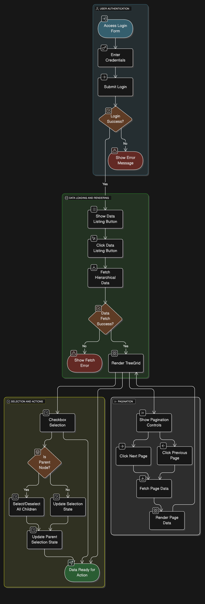

## Setup
- `npm install`
- `npx playwright install-deps`
- `npx playwright test`

## Test Strategy
### Features scope
- Login form behavior
- Employees table data rendering
- Hierarchical data structure
- Pagination
- Checkbox selection
- Data listing on button click

### Out of scope
- Backend integration (login, data fetching)
- Mobile app testing (unless later required)
- UX (does not seem to applicable for the example app)
- Performance testing

### Some diagram for visualisation

